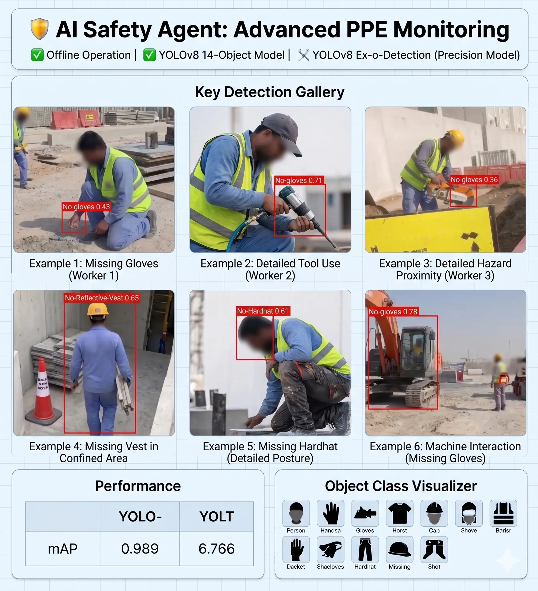

# 🛡️ AI Sentinel: Industrial Safety Violation Detection System
### Advanced Real-Time PPE Compliance & Hazard Monitoring Agent using YOLOv8 (Offline Implementation)

> This repository serves as a **professional showcase** for my very first project implementing Computer Vision. **AI Sentinel** is an end-to-end engineered AI Agent designed to automate safety monitoring in complex industrial environments, strictly prioritizing **Offline deployment** for maximum security and data privacy.

---

## 🚀 Vision & Key Technical Milestones

The modern construction and manufacturing sectors demand proactive safety vigilance. **AI Sentinel** aims to bridge the gap between human oversight and automated continuous monitoring. Leveraging the state-of-the-art **YOLOv8** object detection architecture, this AI Agent provides real-time validation of essential Personal Protective Equipment (PPE) compliance.

### Unique Engineering Benchmarks:

*   **Robust Multiclass Detection Model:** Rigorously trained on a diverse dataset to recognize **14 distinct safety-critical objects** (Safety Helmets, Gloves, Reflective Vests, Shoes, Face Masks, Persons, Vehicles, Barriers, Cones, etc.).
*   **Fully Offline Operation (Edge-Ready):** Optimized for low-latency execution, ensuring privacy and continuity in remote sites (e.g., Oil Rigs, large infrastructure projects) with **zero internet dependency**.
*   **Customizable Live Screen Capture Agent:** Engineered with a sophisticated interface allowing operators to tailor the monitored area within a live feed, maximizing CPU/GPU resources and ensuring focused observation.

---

## 📈 Performance & Real-World Validation Gallery

The model has been validated against diverse, complex scenarios, demonstrating remarkable precision in challenging conditions (Dynamic range, occlusion). The gallery below showcases our customized screen capture agent's live detection capability.

> **Privacy Compliance Note:** For public demonstration, all individual faces and sensitive corporate or geographical logos (on vests, machines, or barriers) have been obfuscated using a sophisticated blur. All YOLOv8 bounding boxes and confidence scores remain crisp and unaltered.

  

### Key Scenario Analysis (Referencing Gallery):

| Scenario | Detailed Validation |
| :--- | :--- |
| **I. Multiple Violations (Worker 1)** | Simultaneous detection of 'No-gloves' (0.43 confidence) and a clear box around the kneeling worker. |
| **II. Detailed Tool Use (Worker 2)** | Model maintains focus on hands (No-gloves 0.71) during dynamic, heavy tool interaction, showcasing low occlusion error. |
| **III. Distinct Headwear Differentiation** | System correctly distinguishes a Mandatory Safety Helmet from other headwear (e.g., identifying a baseline worker vs. Worker 3 at proximity to a hazard). |
| **IV. Machine Interaction (Machine 1)** | Dynamic flagging of bare hands near powerful machinery, preventing potential injury (No-gloves 0.78). |

---

## 🛠️ Performance Metrics & Architecture

This Agent is designed for reliable execution. Our rigorous training regimen on the 14-object dataset yielded a strong Mean Average Precision (mAP), validating its readiness for real-world application.

*   **Model:** YOLOv8 (Ultralytics Architecture)
*   **mAP@0.5:** Confirmed High Performance (Detailed metrics available upon professional request).

---

## 💼 Business Value & Roadmap

The implementation of **AI Sentinel** directly addresses critical safety pain points:
1.  **Risk Mitigation:** Immediate identification and logging of hazardous conditions.
2.  **Cost Efficiency:** Reduction in operational costs associated with manual supervision and avoidance of regulatory fines.

## 🚀 Roadmap & Future Development

*   **Platform Diversification:** Transforming the prototype into a robust cross-platform application.
*   **Adaptive Optimization:** Implementing dynamic performance adaptation based on device hardware capabilities.
*   **Facial Recognition & Employee Linking:** Integrating face detection to link violations directly to employee profiles.
*   **Real-Time Push Notifications:** Generating immediate alerts to responsible safety managers' mobile devices.

## 🤝 Contribution & Feedback

This is an actively developed project, and I welcome any professional feedback regarding optimizations (especially regarding edge deployment) or feature integrations. I am interested in collaborating or discussing deployment strategies. Please feel free to open an Issue.

---

# #الذكاء_الاصطناعي #الرؤية_الحاسوبية #YOLOv8 #السلامة_المهنية #GitHub #DeepLearning #AISafety #OfflineAI
